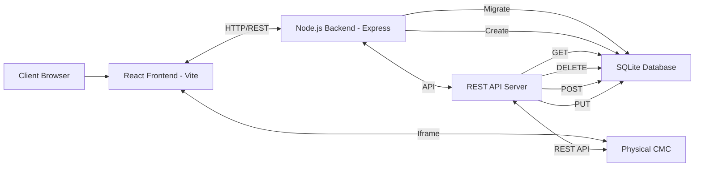

# Architecture

## Overview

CMC Central Manager is a full-stack web application for managing multiple Chassis Management Controllers from a centralized interface.

## System Architecture

    ┌───────────────────────────────────────────────┐ 
    │                Client Browser                 │ 
    │   ┌───────────────────────────────────────┐   │ 
    │   │ React Frontend (Vite)                 │   │ 
    │   │ - UI Components                       │   │ 
    │   │ - State Management                    │   │ 
    │   │ - CMC API Client                      │   │ 
    │   └───────────────────────────────────────┘   │
    └─────────┬─────────────────────────────────────┘ 
              │ HTTP/REST
    ┌─────────┴─────────────────────────────────────┐ 
    │          Node.js Backend (Express)            │ 
    │  ┌─────────────────────────────────────────┐  │ 
    │  │ REST API Server                         │  │ 
    │  │ - CMC CRUD Operations                   │  │ 
    │  │ - Input Validation                      │  │ 
    │  │ - CORS Handling                         │  │ 
    │  └─────────────────────────────────────────┘  │ 
    │                      ▼                        │ 
    │  ┌─────────────────────────────────────────┐  │
    │  │                                         │  │
    │  │ SQLite Database                         │  │
    │  │                                         │  │
    │  │ - CMC Configurations                    │  │ 
    │  │ - Credentials Storage                   │  │ 
    │  └─────────────────────────────────────────┘  │ 
    └─────────┬─────────────────────────────────────┘ 
              │ HTTPS/API Calls ▼ 
    ┌─────────┴─────────────────────────────────────┐ 
    │              Physical CMC Devices             │
    │                                               │ 
    │      - Power Management                       │ 
    │      - Hardware Monitoring                    │ 
    │      - Firmware Management                    │ 
    └───────────────────────────────────────────────┘

## Technology Stack

### Frontend
- **React 18**: Modern UI framework
- **Vite**: Fast build tool
- **DaisyUI**: Component library
- **Tailwind CSS**: Utility-first CSS
- **Lucide React**: Icon library

### Backend
- **Node.js**: JavaScript runtime (ESM)
- **Express**: Web framework
- **better-sqlite3**: SQLite database driver
- **CORS**: Cross-origin handling

### Database
- **SQLite3**: Embedded relational database
- **WAL Mode**: Write-Ahead Logging for concurrency

## Data Flow

### 1. CMC List View

User → Frontend → GET /api/cmcs → Backend → Database → Return CMCs → Display

### 2. Add CMC

User fills form → POST /api/cmcs → Validate → Insert to DB → Return new CMC → Update UI

### 3. CMC Control

User clicks control → Frontend API call → Direct to CMC → CMC executes → Response

### 4. Authentication

User selects CMC → Frontend requests token → CMC /api/login → Store in localStorage → Use for subsequent calls

## Security Considerations

1. **Credential Storage**: Plain text in SQLite (consider encryption)
2. **Token Management**: Session-based tokens in localStorage
3. **CORS**: Configurable origin restrictions
4. **HTTPS**: Recommended for production
5. **Network Isolation**: Should run on trusted networks

## Scalability

- **SQLite Limitations**: Good for <100 CMCs
- **Concurrent Access**: WAL mode supports multiple readers
- **Network Performance**: Direct CMC calls from browser
- **Horizontal Scaling**: Not designed for multi-instance deployment

## Deployment Models

### 1. Development
- Frontend: Vite dev server (port 5173)
- Backend: Node.js (port 3001)
- Access: localhost

### 2. Production (Single Server)
- Frontend: Static files via nginx/Apache
- Backend: PM2 managed Node.js process
- Database: Local SQLite file
- Access: LAN/VPN

### 3. Production (Docker)
- Frontend: nginx container
- Backend: Node container
- Shared volume for database
- Access: Reverse proxy

## Future Enhancements

- User authentication and authorization
- Multi-user support with permissions
- Audit logging
- Database encryption
- High availability setup
- WebSocket for real-time updates
- Role-based access control (RBAC)